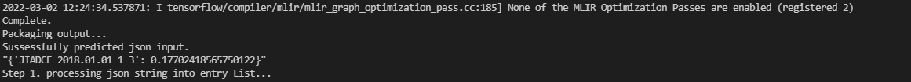
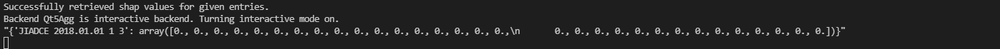
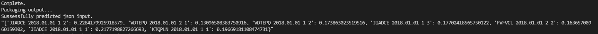
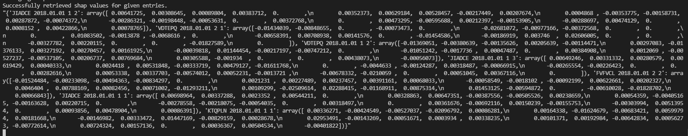
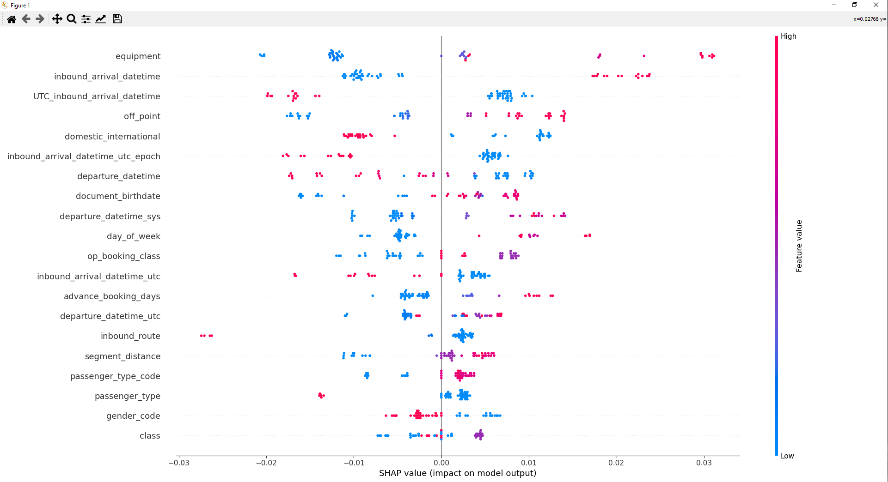
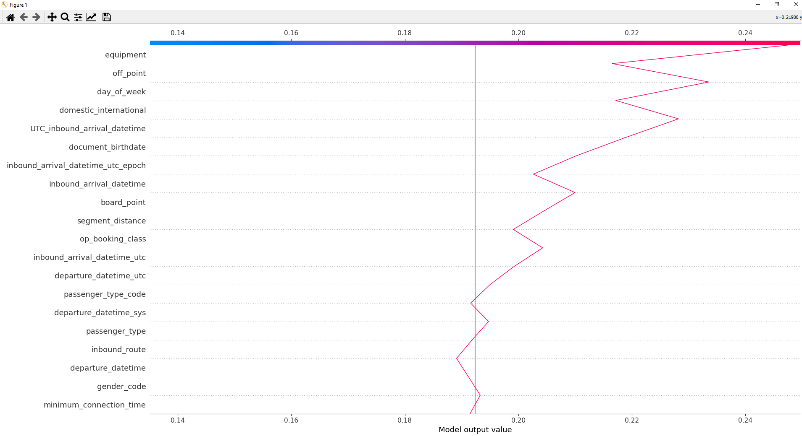
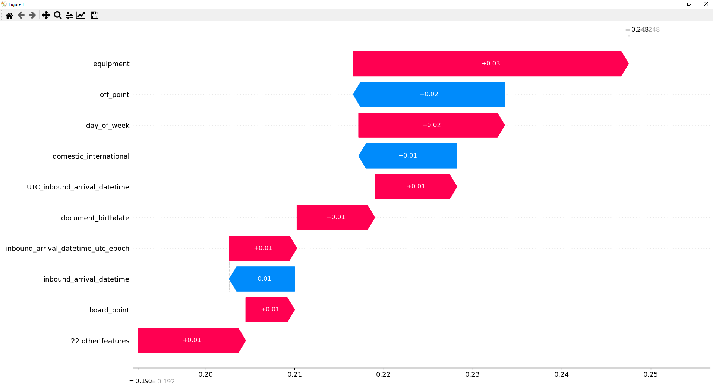
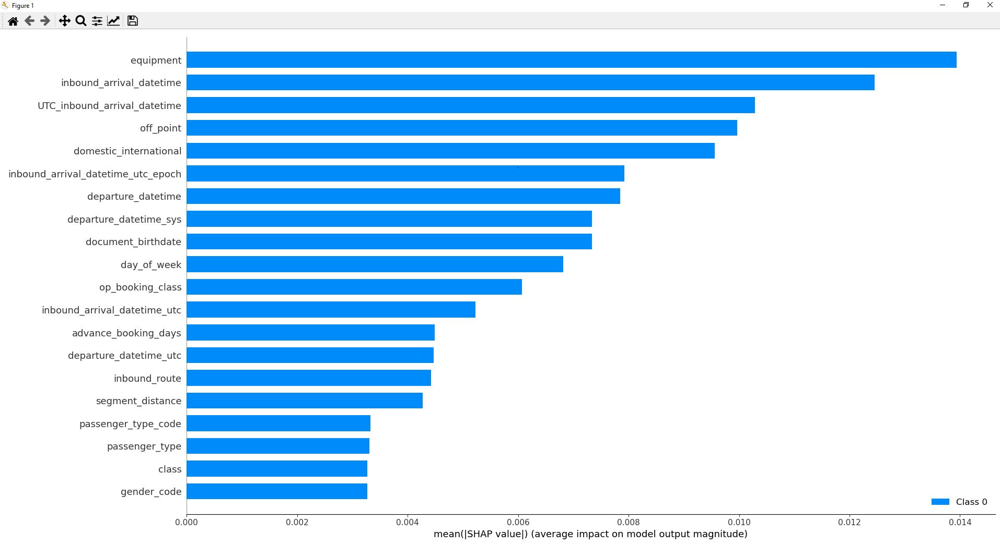
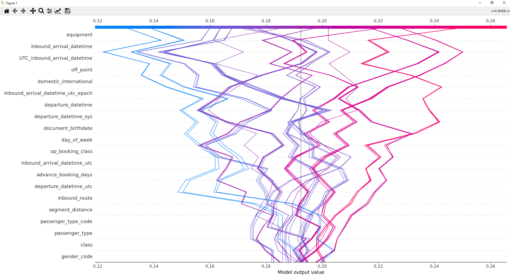

# AirlineNoShowPrediction
Using Machine learning to model predictions of people not showing up for flights.
A tool kit I designed/made a while back for shaping/saving and manipulating data for any kind of machine learning model. It implements many python packages, Tensorflow, pandas, numpy, seaborn, SHAP and many others.
Inside of the tools there is a Readme.py showing how to use these tools for machine learning models.
There are also some visualisation tools for visualizing data used for machine learning models as well as graphs visualizing the output of the models.
This will work for any kind of data in the format of a .csv or .json file and can save manipulated training as either.
The main idea was to create a dataSpout object which spits out streams of data from json or csv files in a format ready to be parsed into a Neural Network (This was also used with other machine learning approaches such a random forest, decision tree and a couple others I have forgotten). There is a lot of functionality in the dataspout not documented such as different normalisation methods using standard deviation or hyberbolic tan funcitons. I may create a table at a later date. 

## Table Of Functions.
remember to initialise the controller like so:

```
OurController = NoShowController()
```
once we have an instance of a controller we can call methods inside the controller quite simply like so:

```
OurController.pleaseDoSomething()
```

Here is a table of functions:

| Function Call Controller.  | Description |
| ------------- | ------------- |
| .loadModel(modelLocation)  | Before we can use a model to predict we need to call the load model function so that there is a reference model inside the controllers .noShowModel attribute. This function can simply be called again if we wish to switch out the loaded model for another.  |
| .getModel(modelLocation)  | Returns a Tensorflow model from the given save location (a save which uses the format given from controlHelper.saveModel(loaded_model, modelsDataFeeder, saveName)). This was added in later for convenience if we want to compare the performace of a group of models we can just reference their saved location instead of having to load in the models each time. |
| .predictFromJSON(jsonString):  | Takes a JSON string and returns a JSON dictionary containing confidence values. (make sure you know what your model is trying to predict!)  |
| .shapValuesFromJSON(jsonString)  | Takes a JSON string and returns a JSON sictionary containing an array of shap values for each input entry/booking. |
| .getDataflowFeederFromJSON(jsonString)  | Takes a JSON string and returns a Feeder. this allows for data manipulation etc. |
| updateModelWeights(JSONString, epochs, batch_size, saveName, evalTargets, evalDatastream)  | this function will refit the loaded model using new data (which needs to include the target label. ). Takes a JSONString of new trainingData, number of epochs to train it for, batch_size for each training input, a new saveName, boolean to evaluate the target data, boolean to evaluate the dataflow being passed|
| .loadRandomEntries(poolSize, seedNumber, dataLocation) | Returns a shuffled list of entries. Takes a poolSize, seedNumber, dataLocation because this function (for the sake of speed) doesn't load the whole file it will only jumble the first 'poolSize' number of entries.|
| .getChordJSON(): | returns a json string of required features for the model input|
| .getModelTrainingChord() | returns a list of features the model was trained on.|
| .getConfidenceList(entryList) | returns a list of confidence values for given entryList|
| .processEntryList(entryList) | performs data enrichment on given entryList and returns a dataPreprosessor (which is a Feeder with some overwritten methods. The code in here is what we would modify to improve the data enrichment for example we could switch out the _dataPreprocessor.distanceTimeEnrichment() for something else.  |
| .processEntryListWithTargetData(entryList) | does the same thing as .processEntryList(entryList), however includes the target labels This function is useful for visualisation on some of the graphs.|
| updateModel | this f|
| updateModel | this f|

## Examples

To retrieve convifence values and shapValues from a JSON string it might look like this. To better understand how the fucntions work I reccommend opening the Tools.readme.py file, uncomment all the functions inside the demoController and debug/step through the commented code. There hve been some changes in the final noshow controller but that was used as the foundation.

```python
#Initialise the controller 
controller = NoShowController()

#Before any prediction we must first load in the model we wish to use like so.
#use '\\' or '/' to traverse directories to avoid truncation error.
modelLocation = 'savedModels\\model2_randomState42_noshowPredictor' 
controller.loadModel(modelSaveLocation)

#here is an example JSON string
exampleJSON = '"[{\'pnr_no_unique\': \'JIADCE 2018.01.01\', \'segment_no\': \'1\', \'passenger_no\': \'3\', \'cancelled\': \'N\', \'seg_cancelled\': \'N\', \'pax_cancelled\': \'N\', \'pnr_status\': \'ACTIVE\', \'no_in_party\': \'3\', \'domestic_international\': \'I\', \'advance_booking_days\': \'20\', \'class\': \'R\', \'booked_connection_time\': \'\', \'minimum_connection_time\': \'\', \'inbound_arrival_datetime\': \'\', \'inbound_arrival_datetime_epoch\': \'\', \'inbound_arrival_datetime_utc\': \'\', \'inbound_arrival_datetime_utc_epoch\': \'\', \'departure_datetime\': \'2018-01-22 10:40:00\', \'departure_datetime_utc\': \'2018-01-22 07:40:00\', \'departure_datetime_sys\': \'2018-01-22 02:40:00\', \'departure_datetime_epoch\': \'1516617600\', \'departure_datetime_utc_epoch\': \'1516606800\', \'day_of_week\': \'1\', \'board_point\': \'SVO\', \'off_point\': \'TIV\', \'flight_route\': \'SVO-TIV\', \'segment_distance\': \'2015\', \'inbound_airport\': \'\', \'inbound_segment_no\': \'\', \'inbound_route\': \'\', \'inbound_equipment\': \'\', \'mkt_carrier_code\': \'SU\', \'mkt_flight_no\': \'2050\', \'op_carrier_code\': \'SU\', \'op_flight_no\': \'2050\', \'op_booking_class\': \'R\', \'equipment\': \'59\', \'gender_code\': \'M\', \'passenger_type_code\': \'CHD\', \'passenger_type\': \'C\', \'document_birthdate\': \'2013-08-05\', \'nosho\': \'t\', \'nosho_type\': \'M\', \'pos_violation\': \'\', \'group_violation\': \'N\', \'fake_name_violation\': \'N\', \'test_booking\': \'N\', \'missing_ttl\': \'N\', \'ttl_incorrect\': \'N\', \'duplicate\': \'N\', \'hidden_group_flag\': \'N\', \'marriage_violation\': \'N\', \'mct_violation\': \'N\', \'time_under_over\': \'\', \'fake_name_violation_match\': \'\', \'fake_name_violation_match_name\': \'\', \'test_passenger\': \'N\'}]"'

#to get predictions we can call the following function which takes a json string arguement.
jsonOutput = controller.predictFromJSON(exampleJSON)
print(jsonOutput)

#to get shap values from a json string we can call
# the cost of this function grows exponentially.
shapValues = controller.shapValuesFromJSON(jsonString) 
print(shapValues)
```

The outputs look like this:


The shap values will look like this:


However, Shap values are calculated based on the significance of each feature on every booking/entry given, in relation to the models output for each given input (it's actually little more complicated than that as it takes a game theoretical approach, but basically it gives each features weighting specifically for the given inputs) so because there is only 1 prediction there are no relationships to determine weights on each feature, thus we see an array of 0.

If we up the number of entry bookings to 10 however:


For the shap values:


For some output visualisations we can do this:
```python
controller.visualiseOutput(entryList)
```

So these shap values are based off of 50 entrys, The first visual is an overall summary and the second and third visuals are for the first entry given in relation to all that follow.

Which will display somke visualisations like so:
Beeswarm (although I call a summary plot but shap is just broken haha)plots for all inputs

Decision plot for just the first input.

WaterfallPlot for just the first input



similarly we can call for a more overall visualisation
```python
controller.visualiseOutput2(entryList)
```
an actual summary plot

dicision plot for something haha.


Here are some random pictures I found from this project.

there is functionality to show a confusion matrix for results of model


Training visualisation


As well as all kinds of visualisations for the training data. You can plot any feature agains any other by just passing the column names into the data visualisation functionality.


Even 3D graph models.


For output visualisation

significance of each feature for the output. This was derived by calculating shap (weighted) values which uses a recursive game theoretical approach. May explain later but its just a python library.


I forgot what these are but they look cool


But ultimately yeah. I think this is pretty implementable for most ML models and datasets. Peace out!
